# 112590024 邱紹溏 資工三
# 112590004 邱昱綸 資工三

## 編譯方法
```
make
```
刪除
```
make clean
```


## Ch 2

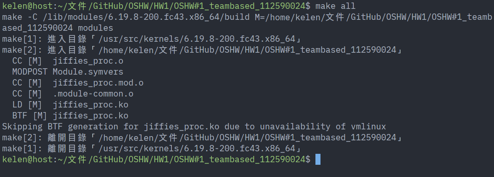


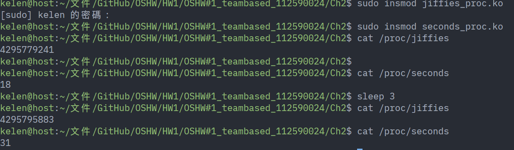


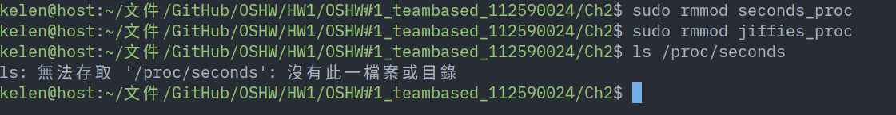

## Ch 3.1


## Ch3.2

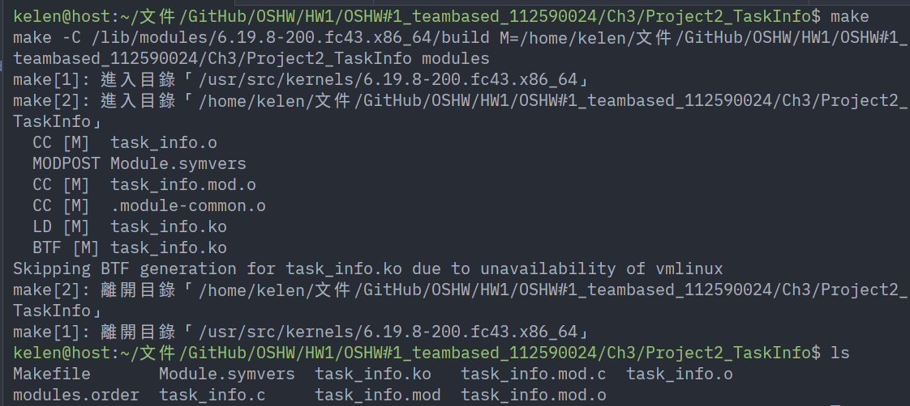

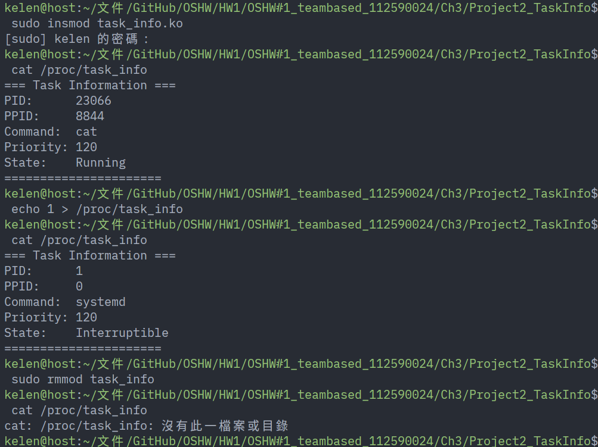

## Ch3.3

### Part1  

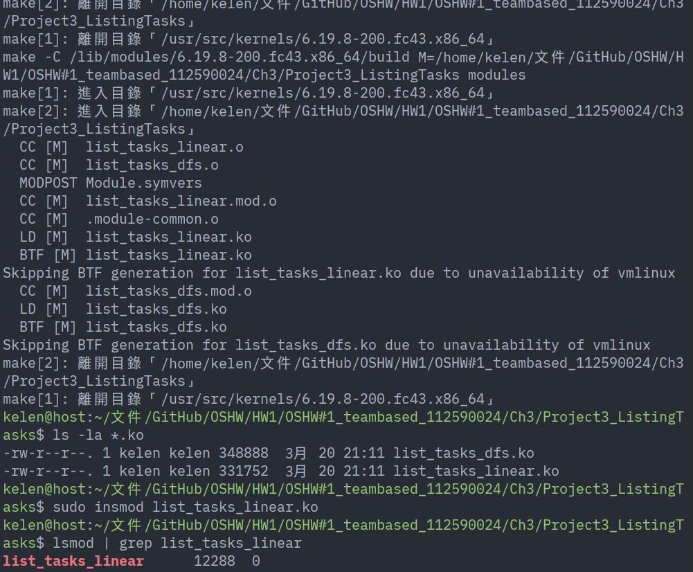

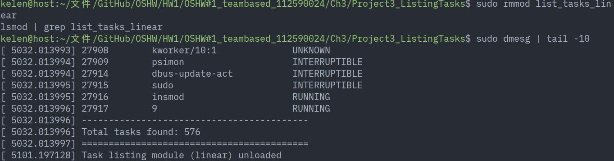

### Part2

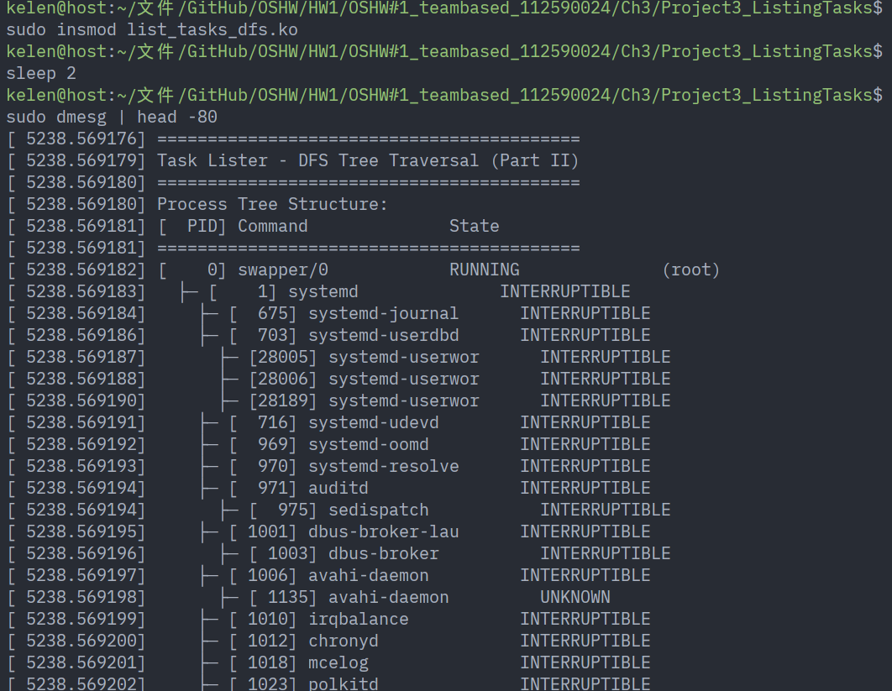

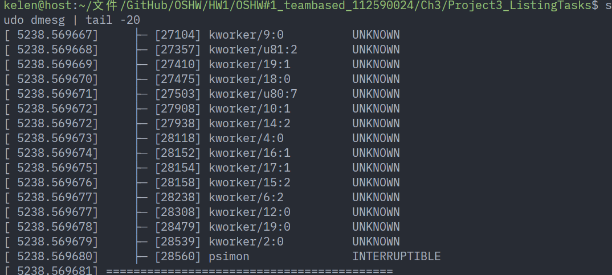

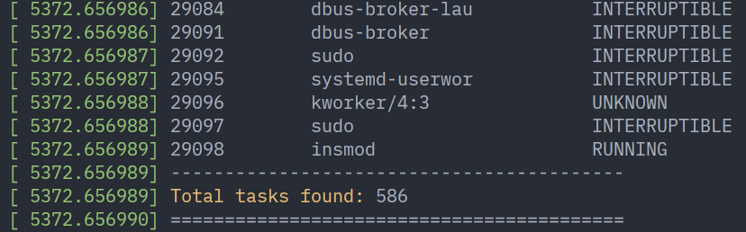

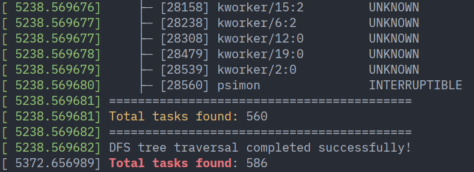

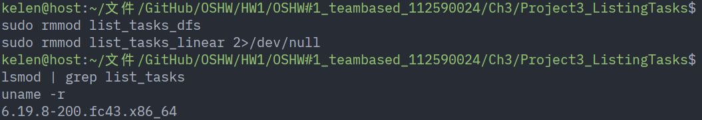

## Ch3.4

### Part1

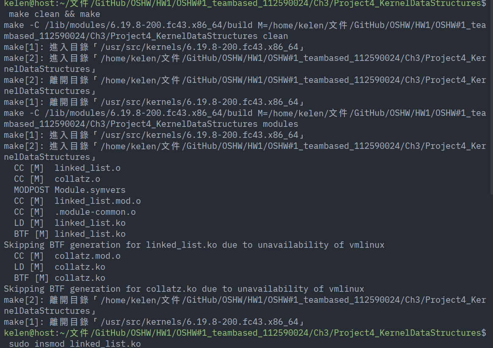

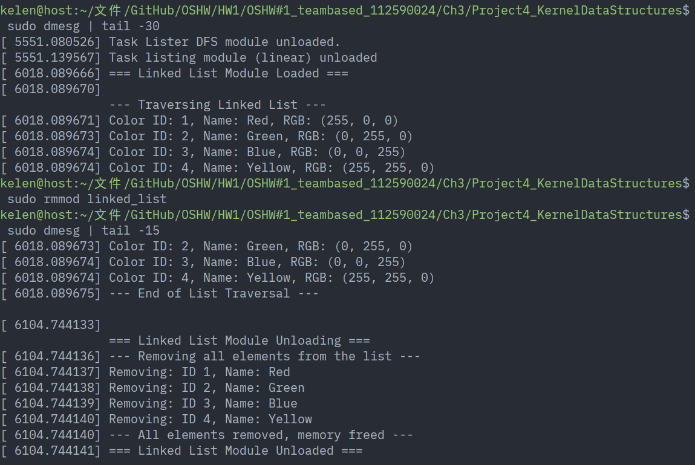

### Part2

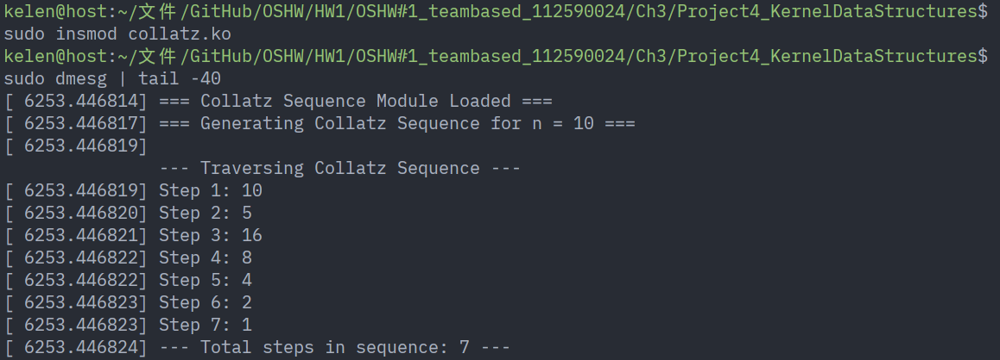

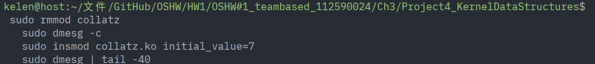

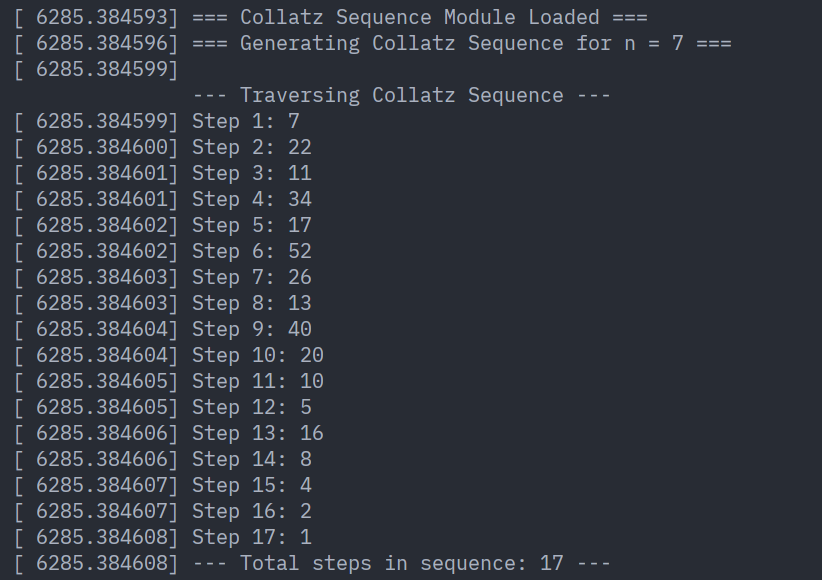

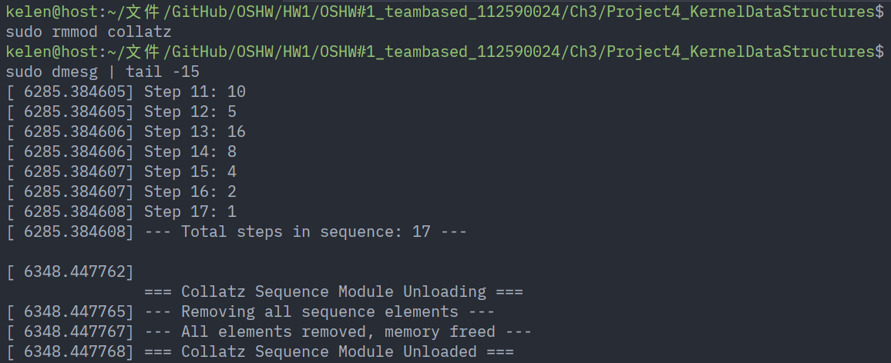