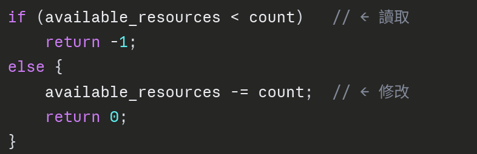
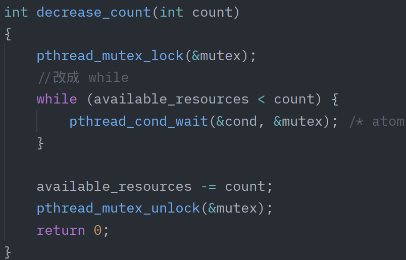
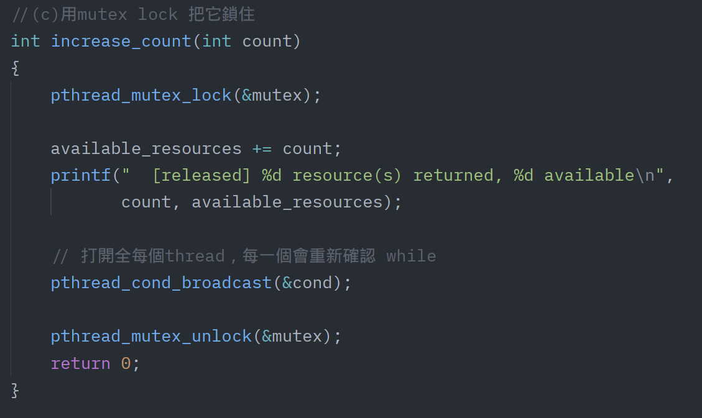

# 112590024 邱紹溏 資料庫作業 HW2

## 4.24

正方形面積 = 2 × 2 = 4
圓形面積   = π × r² = π × 1² = π
圓/正方形 = π/4→ π = 4 × (落在圓內的點數) / (總點數)

## 4.28

100 個 thread 各自拿到不同的 PID，sleep不同的時間，最後全部釋放，bitmap 歸零 

## 6.33
### (a)
這個全域變數 available_resources

當多個 process/thread 同時讀寫它：

* Step 1: 從記憶體讀取 available_resources 的值
* Step 2: 計算新的值（加或減）
* Step 3: 把新值寫回記憶體

如果兩個 thread 同時做這三步，中間就會互相干擾。

### (b)

位置一：Thread A 讀完發現「夠用」，還沒減掉之前，Thread B 也讀了同一個值也覺得「夠用」，兩個都去減，結果 `available_resources` 變成負數。

位置二：同樣的問題，兩個 thread 同時歸還資源，可能其中一個的修改被蓋掉。

### (c)
用 Mutex 修正

