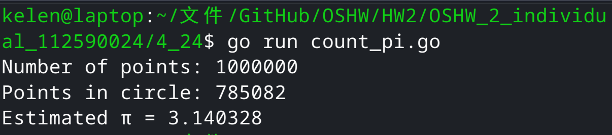
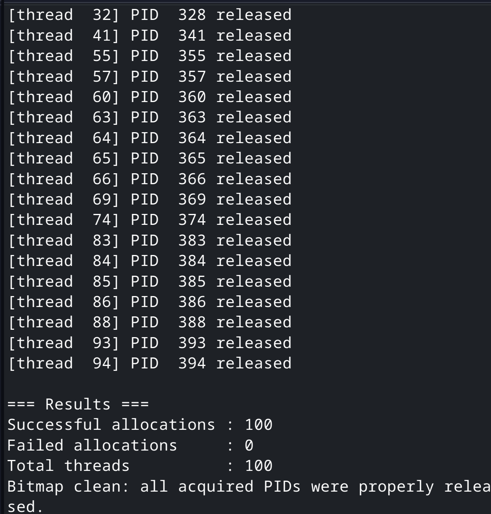

# 112590024 邱紹溏 資料庫作業 HW2

## 4.24

正方形面積 = 2 × 2 = 4
圓形面積   = π × r² = π × 1² = π
圓/正方形 = π/4→ π = 4 × (落在圓內的點數) / (總點數)

## 4.28

100 個 thread 各自拿到不同的 PID，sleep不同的時間，最後全部釋放，bitmap 歸零 

## 6.33
### (a)

### (b)

