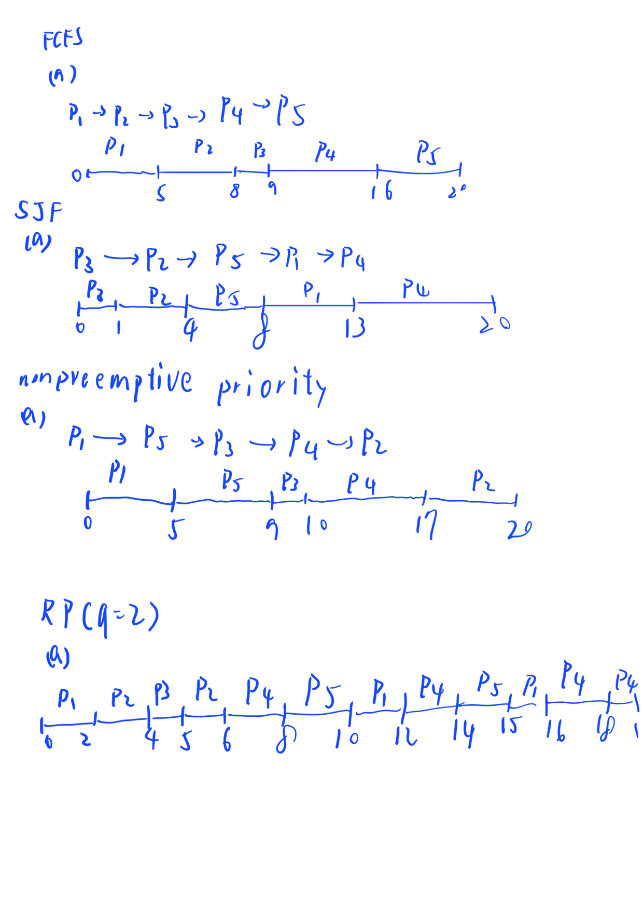
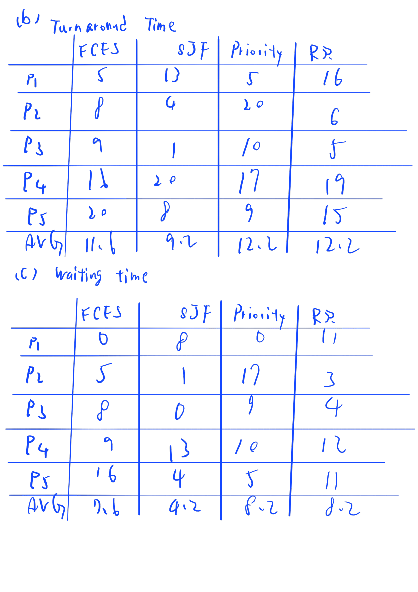
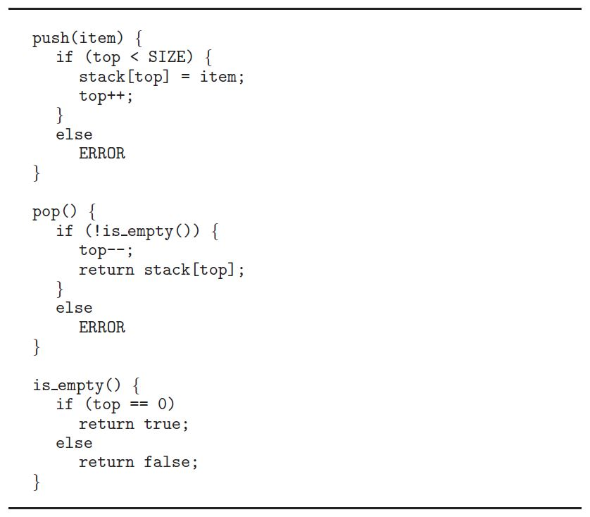
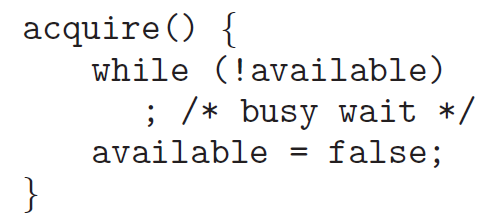
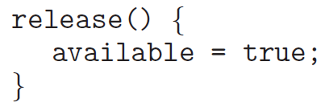

# 112590024 邱紹溏 資料庫作業 HW2

```
4.9: Under what circumstances does a multithreaded solution using multiple kernel threads provide better performance than a single-threaded solution on a single-processor system?

```

## 4.9
在同一CPU下，只有在有 I/O 阻塞的情況下，多核心執行緒才會比單執行緒在單處理器上有更好的效能，如果只是單純 CPU運算則沒沒有差別。

***

```
4.14: Using Amdahl’s Law, calculate the speedup gain for the following applications:
40 percent parallel with (a) eight processing cores and (b) sixteen processing cores

67 percent parallel with (a) two processing cores and (b) four processing cores

90 percent parallel with (a) four processing cores and (b) eight processing cores

```

## 4.14
### 40% parallel（S = 0.4）

**(a) 8 cores:**

$$\frac{1}{(1-0.4)+\frac{0.4}{8}} = \frac{1}{0.65} \approx 1.54$$

**(b) 16 cores:**

$$\frac{1}{(1-0.4)+\frac{0.4}{16}} = \frac{1}{0.625} = 1.60$$

---

### 67% parallel（S = 0.67）

**(a) 2 cores:**

$$\frac{1}{(1-0.67)+\frac{0.67}{2}} = \frac{1}{0.665} \approx 1.50$$

**(b) 4 cores:**

$$\frac{1}{(1-0.67)+\frac{0.67}{4}} = \frac{1}{0.4975} \approx 2.01$$

---

### 90% parallel（S = 0.9）

**(a) 4 cores:**

$$\frac{1}{(1-0.9)+\frac{0.9}{4}} = \frac{1}{0.325} \approx 3.08$$

**(b) 8 cores:**

$$\frac{1}{(1-0.9)+\frac{0.9}{8}} = \frac{1}{0.2125} \approx 4.71$$

***

```
4.20: Consider a multicore system and a multithreaded program written using the many-to-many threading model
Let the number of user-level threads in the program be greater than the number of processing cores in the system
Discuss the performance implications of the following scenarios.

a. The number of kernel threads allocated to the program is less than the number of processing cores.

b. The number of kernel threads allocated to the program is equal to the number of processing cores.

c. The number of kernel threads allocated to the program is greater than the number of processing cores but less than the number of user-level threads.

```

## 4.20

### (a) **kernel threads < processing cores**

> 因為沒有足夠的 kernel threads 來讓所有processing cores保持忙碌，所以部分處理器會閒置。


### (b) **kernel threads = processing cores**

> 這是最理想的情況。所有處理器核心都被使用，且當一個 kernel thread 阻塞時，處理器可以切換到另一個 kernel thread。


### (c) **kernel threads > processing cores 但 < user-level threads**

> 效能與 (b) 類似。額外的 kernel threads 在某個 kernel thread 阻塞時可以提供效能優勢，因為另一個 kernel thread 可以被排程到可用的處理器上。然而，kernel threads 之間的 context switching 可能會帶來一些額外開銷。

***

```
5.14: Most scheduling algorithms maintain a run queue, which lists processes eligible to run on a processor. 
On multicore systems, there are two general options: 

(1) each processing core has its own run queue, or 

(2) a single run queue is shared by all processing cores. 

What are the advantages and disadvantages of each of these approaches?

```

## 5.14

### (1)
**優點：**

* 不需要競爭共用 queue 的 lock，因此存取 queue 的效能較好
* 由於 process 傾向在同一個 core 上執行，cache 資料可以被保留，**cache affinity 較佳**

**缺點：**

* 可能造成**負載不均衡**，某些 core 的 queue 很長，其他 core 的 queue 卻是空的
* 需要額外實作 **load balancing** 來解決不均衡問題

### (2)
**優點：**

* 自動達到**負載均衡**，因為所有 core 都從同一個 queue 取 process
* 不需要額外的 load balancing 機制

**缺點：**

* 存取共用 queue 必須加鎖，因為core可能會搶到相同的Task，當核心數增加時會產生**效能瓶頸**
* **cache affinity 較差**，同一個 process 可能被分配到不同的 core 上執行，導致 cache 資料失效

***

```
5.17: Consider the following set of processes, with the length of the CPU burst given in milliseconds: 

```


```

The processes are assumed to have arrived in the order P1, P2, P3, P4, P5, all at time 0.

(a) Draw four Gantt charts that illustrate the execution of these processes using the following scheduling algorithms: FCFS, SJF, nonpreemptive priority (a larger priority number implies a higher priority), and RR (quantum = 2)

(b) What is the turnaround time of each process for each of the scheduling algorithms in part (a)?

(c) What is the waiting time of each process for each of these scheduling algorithms?

(d) Which of the algorithms results in the minimum average waiting time (over all processes)?

```

## 5.17

### (a)(b)(c)





### (d) 
**SJF 的平均等待時間為 4.2 ms**，是四種演算法中最低的。

***

```
5.22: Consider a system running ten I/O-bound tasks and one CPU-bound task. 
Assume that the I/O-bound tasks issue an I/O operation once for every millisecond of CPU computing and that each I/O operation takes 10 milliseconds to complete. 
Also assume that the context-switching overhead is 0.1 millisecond and that all processes are long-running tasks.
Describe the CPU utilization for a round-robin scheduler when:

(a) The time quantum is 1 millisecond

(b) The time quantum is 10 millisecond

```

## 5.22
### (a) Time Quantum = 1ms
IO：0.1 + 1 + 0.1 = 1.2ms
total IO = 12ms
CPU = 1.2ms
total = 13.2
真正有用 = 11
CPU使用率 = 11/13.2 = 83.3%​

### (b)
IO：0.1 + 1 + 0.1 = 1.2ms
total IO = 12ms
CPU = 10.2ms
total = 22.2
真正有用 = 20
CPU使用率 = 20/22.2 = 90.1%​

較大的 time quantum 能讓 CPU-bound 任務攤平 switch 的開銷，整體使用率提升。而 I/O-bound 任務因為在 quantum 結束前就主動封鎖，不論 quantum 大小行為都一樣。

***
```
5.25: Explain the differences in how much the following scheduling algorithms discriminate in favor of short processes:

(a) FCFS

(b) RR

(c) Multilevel feedback queues 

```

## 5.25
### (a) FCFS
最不利於短行程，假設短行程前有較長的行程，需要等待前面的先完成。

### (b) RR
略好短行程。短行程若能在一個週期內完成即可離開，最公平，週期越小，效果越明顯。

### (c) Multilevel feedback queues 
最優待短行程。短行程在高優先權佇列就能完成，長行程則不斷被降級，模擬 SJF 的效果。

優待程度：FCFS < RR < Multilevel Feedback Queues

***
```
6.7: The pseudocode of Figure 6.15 illustrates the basic push() and pop() operations of an array-based stack. 
Assuming that this algorithm could be used in a concurrent environment, answer the following questions:

(a) What data have a race condition?

(b) How could the race condition be fixed?

```



## 6.7
###  (a) Race Condition 的資料
top 與 stack[] 有 race condition。


### (b) 如何修正
對 push() 和 pop() 加 mutex lock，使操作成為 atomic。

***
```
6.15: Explain why implementing synchronization primitives by disabling interrupts is not appropriate in a single-processor system if the synchronization primitives are to be used in user-level programs.
```

## 6.15
中斷關閉是kernel level的特權操作，user-level 程式沒有權限執行。
就算可以執行，當user 程式關閉中斷，OS 的 timer interrupt 也會被擋住，OS 就無法強制切換行程、奪回 CPU，整個系統會卡死。

***
```
6.18: The implementation of mutex locks provided in Section 6.5 suffers from busy waiting. 
Describe what changes would be necessary so that a process waiting to acquire a mutex lock would be blocked and placed into a waiting queue until the lock became available.
```





## 6.18
因為buzy wait，長時間不會被呼叫，可以在acquire()裡面新增 sleep()，來暫時讓出cpu使用權，等到要用到時在從release()裡，新增 wakeup()，重新呼叫
