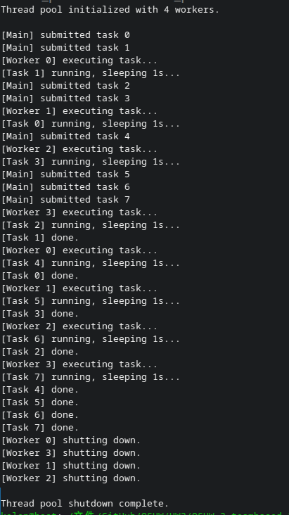
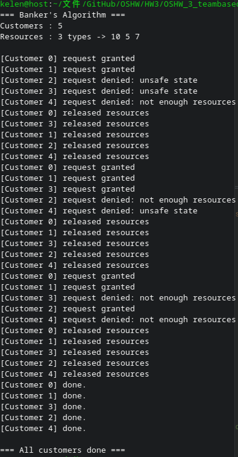
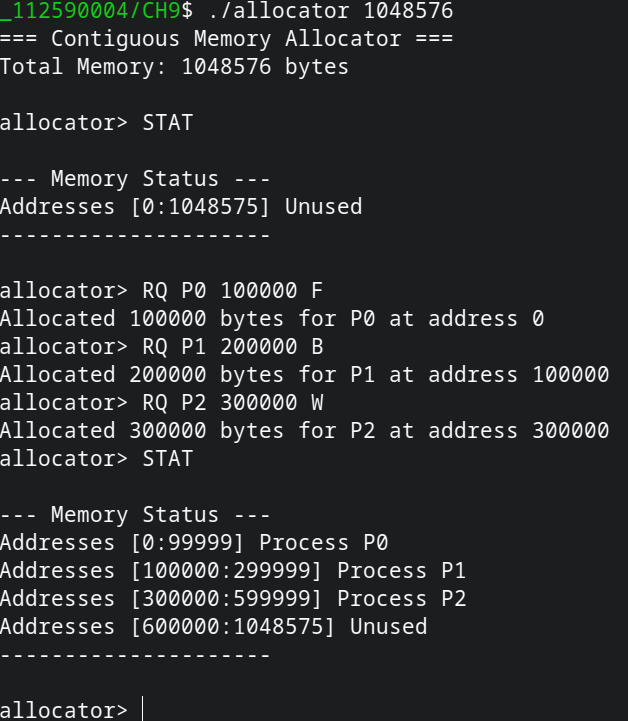
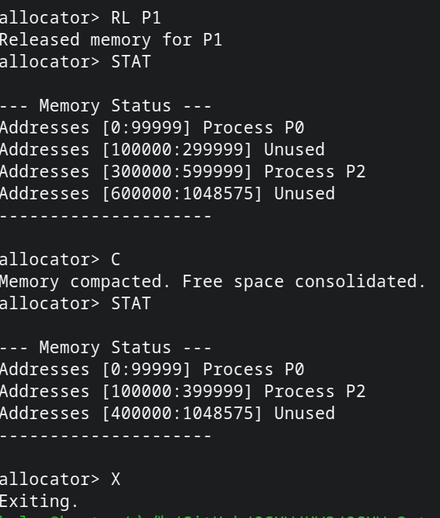

# 作業系統作業 HW3
## 112590024 邱紹溏 資工三
## 112590004 邱昱綸 資工三

## CH7 Project 1
* 建立一個固定大小的 thread pool
* 有一個 **task queue** 存放待執行的任務
* Worker thread 從 queue 取出任務執行
* 用 **mutex + semaphore** 保護 task queue

## CH8
5 個 customer thread 持續隨機請求和釋放資源，每次請求前先跑 Safety Algorithm 確認分配後系統仍在 safe state，用 mutex 保護共享的 available、allocation、need 陣列。

# CH9

* 記憶體大小從 **command line** 傳入
* 支援四個指令：**RQ**（request）、**RL**（release）、**C**（compact）、**STAT**（report）
* 支援三種分配演算法：**F**（first-fit）、**B**（best-fit）、**W**（worst-fit）

- 初始化
- 分配記憶體（三種演算法各一個）

- 釋放記憶體
- Compact
- 結束

