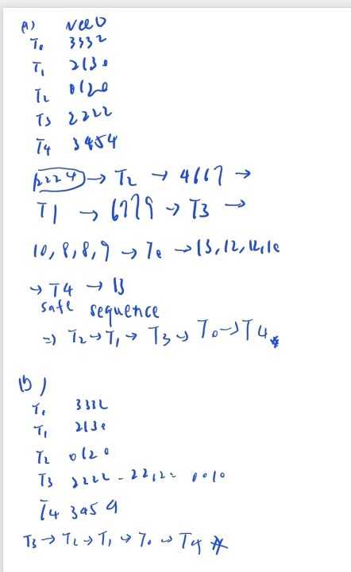

# 112590024 邱紹溏 作業系統作業 HW3

```
 7.8: The Linux kernel has a policy that a  process cannot hold a spinlock while  attempting to acquire a semaphore. Explain  why this policy is in place.
```

## 7.8

因為持有 Spinlock 的行程「絕對不能休眠」，而嘗試獲取 Semaphore 失敗時會強迫「進入休眠」。

若帶著 Spinlock 進入休眠，會導致其他等待 Spinlock 的程式在 CPU 上不斷空轉，最後造成系統 Deadlock。

***

```
8.20: In a real computer system, neither the resources available nor the demands of processes for resources are consistent over long periods (months). Resources break or are replaced, new processes come and go, and new resources are bought and added to the system.

If deadlock is controlled by the banker’s algorithm, which of the following changes can be made safely (without introducing the possibility of deadlock), and under what circumstances?
 (a) Increase Available (new resources added).

 (b) Decrease Available (resource permanently  removed from system).

 (c) Increase Max for one process (the process  needs or wants more resources than allowed).

 (d) Decrease Max for one process (the process  decides that it does not need that many  resources).

 (e) Increase the number of processes.

 (f) Decrease the number of processes.


```

## 8.20

### (a)

絕對安全。資源變多只會讓系統更有餘裕，原本的 safe sequence 還是成立。

### (b)

不一定安全。少了資源，原本的 safe sequence 可能跑不下去，必須重新跑 Safety Algorithm 確認還能找到 safe sequence 才行。

### (c)

不一定安全。Max 變大代表 Need 也變大，行程未來可能跟系統要更多資源，必須重新跑 Safety Algorithm 確認系統還在 safe state。


### (d)

安全。但前提是新的 Max 不能比該行程**已經拿到的 Allocation 還少**。Need 變小對系統只有好處。


### (e)

不一定安全。新行程加入時會帶來新的資源需求，必須重新跑 Safety Algorithm，確認加入後系統還能找到 safe sequence。


### (f)

安全。行程離開會把它佔用的資源還給系統，Available 增加，系統只會變得更安全。

***

```
Answer the following questions using the banker’s algorithm. 
(a)Illustrate that the system is in a safe state by demonstrating an order in which the threads may complete.
(d) If a request from thread T3 arrives for (2, 2, 1, 2), can the request be granted immediately? Show the reasons why.

```

## 8.28




***

```
8.30: A single-lane bridge connects the two Vermont villages of North Tunbridge and South Tunbridge. Farmers in the two villages use this bridge to deliver their produce to the neighbor town. 
The bridge can become deadlocked if a northbound and a southbound farmer get on the bridge at the same time. (Vermont farmers are stubborn and are unable to back up.)
Using semaphores and/or mutex locks, design an algorithm in pseudocode that prevents deadlock. 
Initially, do not be concerned about starvation (the situation in which northbound farmers prevent southbound farmers from using the bridge, or vice versa).
```

## 8.30

Pseudocode

``` 
mutex bridge_lock = 1

northbound_farmer():
    wait(bridge_lock)
    cross_bridge()
    signal(bridge_lock)

southbound_farmer():
    wait(bridge_lock)
    cross_bridge()
    signal(bridge_lock)
```

一個一個過，用bridge_lock鎖住，來讓一邊先通行。


***


` `
