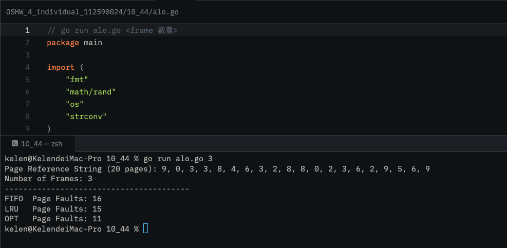
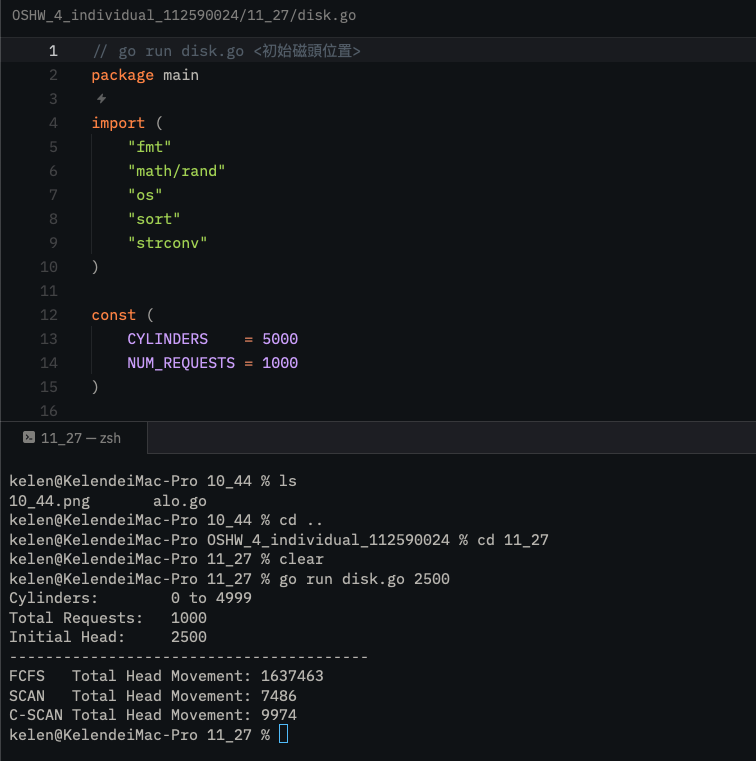

# 112590024 邱紹溏 作業系統作業 HW4

##  10.44

OPT ≤ LRU ≤ FIFO

## 11.27

* **FCFS**：按照請求進來的順序一個一個服務，不做任何排序或優化

* **SCAN**：先對所有請求排序，從當前位置往高編號處理完，再回頭處理低編號的

* **C-SCAN**：同樣排序後往高編號處理，處理完後直接跳到最低編號，再繼續往高編號處理剩下的，不回頭
